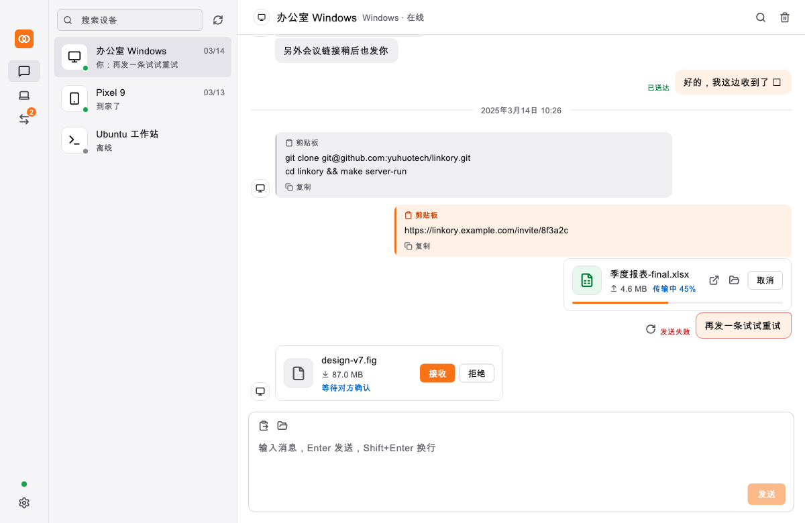
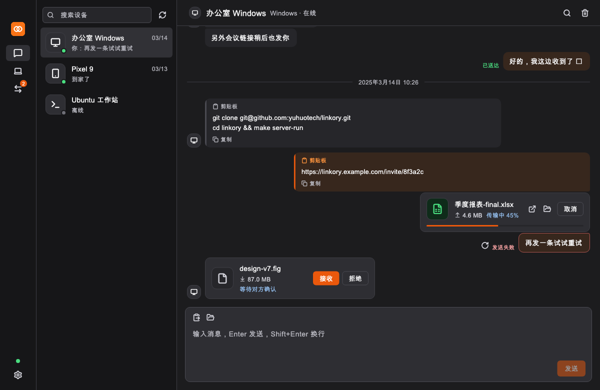
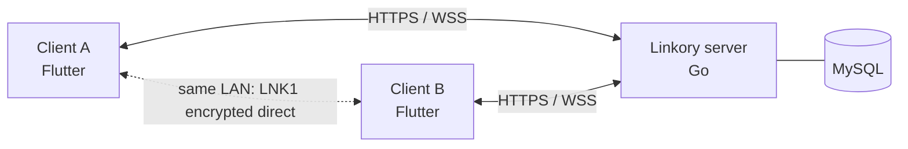

<div align="center">


# Linkory (连信)

**Send text, clipboard contents and files between your own devices — fast, private, self-hosted.**

[](https://github.com/yuhuotech/linkory/actions/workflows/release.yml)
[](https://github.com/yuhuotech/linkory/releases)
[](LICENSE)


[Download](#download) · [Quick start](#quick-start) · [Docs](#documentation) · [简体中文](README.md)

</div>

<p align="center">
  
  
</p>

## What it is

Sign in with one account on all your devices; they show up as conversations, WeChat-style. Messages arrive in real time; files go **directly and end-to-end encrypted over the LAN** when the devices share a network, otherwise through **your own server**, streamed in memory and never written to disk. No third-party cloud involved.

## Features

- Per-device conversations: text, links, clipboard, delivery receipts, retry, offline messages (30 days by default).
- File transfer: drag & drop, multiple files, progress/speed, cancel/retry, auto-accept (switchable). The receiver always verifies SHA-256 before saving.
- LAN direct transfer (`LNK1`: HMAC mutual authentication + ChaCha20-Poly1305, resumable) with automatic fallback to the relay.
- Inline image previews with a full-window viewer.
- Desktop niceties: tray, notifications, launch at login, rounded frameless window, light/dark themes.
- In-app updates from GitHub Releases (Ed25519-signed checksums; a mainland-China mirror option for users who cannot reach GitHub).
- Security: Argon2id passwords, rotating refresh tokens with reuse detection, per-device identity keys.
- Self-hosted: a single Go binary + MySQL, or Docker Compose.

## Download

Get installers from [Releases](https://github.com/yuhuotech/linkory/releases) (versions with `rc`/`beta` are pre-releases).

| Platform | Status | File |
|---|---|---|
| macOS (Apple silicon) | ✅ verified | `.dmg` (signed and notarized: opens without warnings) |
| Linux x64 | ✅ verified | `.deb` (`sudo apt install ./Linkory-*.deb`) or `.tar.gz` |
| Android | ✅ verified (emulator) | `.apk` |
| Windows x64 | 🟡 built in CI | installer `.exe` or portable `.zip` — feedback welcome |
| iOS | ⛔ no package | needs Apple developer signing |
| Server | ✅ | `linkory-server-<version>-<os>-<arch>` archives |

Each release ships `SHA256SUMS.txt` and its signature `SHA256SUMS.txt.sig`.

## Quick start

1. **Run the server** (MySQL 8 with an empty database; tables are migrated on start):

   ```sh
   export LINKORY_MYSQL_DSN='linkory:PASSWORD@tcp(127.0.0.1:3306)/linkory?parseTime=true&charset=utf8mb4&loc=UTC'
   export LINKORY_JWT_SECRET="$(openssl rand -hex 32)"   # keep it fixed, or every restart signs everyone out
   LINKORY_ADDR=':8080' ./linkory-server
   ```

   Or `cd deploy && cp .env.example .env && docker compose up -d --build`. Put it behind HTTPS/WSS for public use — see the [deployment guide](docs/DEPLOYMENT.md) (Chinese).
2. **Install the app**, open it, choose *Sign in / Register*, enter **your server URL**, and register.
3. On your other devices, install the app and **sign in with the same account** (don't register again). The devices now see each other.

## How it works



Control traffic uses WebSocket; file bytes use HTTPS streaming or the direct LAN channel. Transfers follow a server-validated state machine. See [`linkory-protocol/PROTOCOL.md`](linkory-protocol/PROTOCOL.md).

## Repository layout

`linkory-server/` Go server · `linkory-app/` Flutter client · `linkory-core/` Rust reference implementation of `LNK1` · `linkory-protocol/` protocol spec · `deploy/` Docker Compose · `installer/` Windows/Linux packaging · `tools/` scripts · `docs/` documentation.

## Development

Requirements: Go 1.26+, MySQL 8, Flutter 3.47 (stable), Rust (stable, for `linkory-core`).

```sh
make server-run     # local server (reads linkory-server/.env.local)
make app-run        # client on this machine's desktop platform
make server-test    # go vet + go test (needs LINKORY_TEST_DSN, a disposable database)
make app-test       # flutter analyze + flutter test
make core-test      # cargo test
make e2e            # two independent clients against a real server
```

Releases: push a `v*` tag (`v0.1.0-rc1` is marked pre-release) and GitHub Actions tests, builds, signs and publishes everything. More in [`AGENTS.md`](AGENTS.md).

## Security

Use HTTPS/WSS. Files and messages relayed through the server are readable by the server (no end-to-end encryption yet); LAN-direct transfers are end-to-end encrypted. Update packages are installed only if their checksum file carries a valid Ed25519 signature. Report vulnerabilities privately via GitHub's *Security → Report a vulnerability*.

## Status and limitations

Presence is in-memory, so the server runs as a **single instance** (Redis is needed for more). Not yet: folder transfer, image clipboard, account recovery, end-to-end encryption, mDNS discovery. See the [development plan](docs/DEVELOPMENT_PLAN.md) (Chinese).

## Documentation

Most documents are in Chinese: [deployment](docs/DEPLOYMENT.md) · [protocol](linkory-protocol/PROTOCOL.md) · [PRD](docs/LINKORY_PRD_V1.0.md) · [development plan](docs/DEVELOPMENT_PLAN.md) · [UI spec](docs/UI_SPEC.md).

## Contributing

Issues and pull requests are welcome. Read [`AGENTS.md`](AGENTS.md) and the [UI spec](docs/UI_SPEC.md) first, run the test targets above, and use Conventional Commits (the repository's convention is a Chinese description: `feat(server): …`).

## License

Released under the [MIT License](LICENSE).

## Acknowledgements

The design system is ported from [cc-switch](https://github.com/farion1231/cc-switch) and adapted to a three-column layout; icons are from [Lucide](https://lucide.dev).
