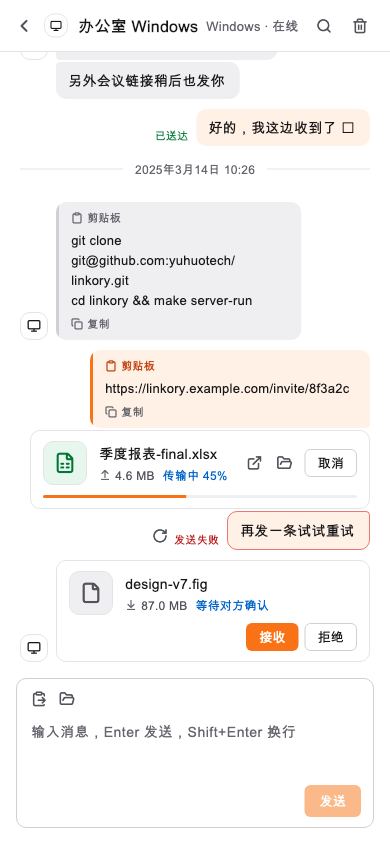
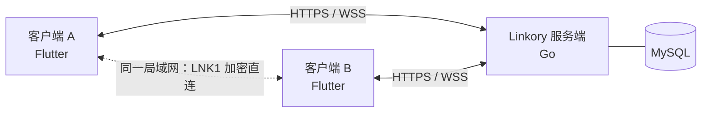

<div align="center">


# 连信 Linkory

**在你自己的多台设备之间，安全、快速地互发文字、剪贴板和文件。自建服务，数据自己掌握。**

[](https://github.com/yuhuotech/linkory/actions/workflows/release.yml)
[](https://github.com/yuhuotech/linkory/releases)
[](LICENSE)


[下载](#下载与安装) · [快速开始](#快速开始) · [文档](#文档) · [English](README.en.md)

</div>

<p align="center">
  
  
</p>

## 简介

连信解决一个朴素的问题：手机、笔记本、台式机和服务器之间，怎么把一段文字、一个链接、一张照片或一个大文件**立刻**送到另一台设备上，而不用经过第三方网盘或聊天软件。

登录同一个账号后，你的设备会互相出现在列表里，像微信一样一个设备一个会话。同一局域网内文件自动走端到端加密直连，否则经你自己部署的服务端流式中转（不落盘）。

## 特性

- **多设备会话**：每台设备一个会话；文字、链接、剪贴板；送达回执、失败重试、离线消息（默认保留 30 天）。
- **文件传输**：拖拽或选择发送，多文件、进度/速度/耗时、取消与重试；默认自动接收，也可改为手动确认。接收端强制 SHA-256 校验，校验通过才落盘。
- **局域网直连**：同一网络内自动直连（`LNK1` 协议：HMAC 互证 + ChaCha20-Poly1305 加密），支持断点续传；不可用时无缝回退服务端中转。
- **图片预览**：聊天内直接显示缩略图，点击全窗口查看（缩放、平移）。
- **桌面体验**：托盘常驻、系统通知、开机启动、窗口圆角（Linux / Windows 11）、浅色 / 深色主题。
- **应用内更新**：每小时检查 GitHub Release，一键下载、校验并安装；访问不了 GitHub 时可切换「国内加速」下载源。
- **安全**：Argon2id 密码哈希、令牌轮换与盗用检测、设备独立身份密钥、移除设备立即失效；更新包经 Ed25519 签名校验。
- **自建部署**：单个 Go 二进制 + MySQL，或 Docker Compose；不依赖任何第三方云服务。

<p align="center">
  
  
</p>

## 平台支持

| 平台 | 状态 | 说明 |
|---|---|---|
| macOS（Apple 芯片） | ✅ 已验证 | `.dmg`（未签名，首次需右键打开） |
| Linux（x64） | ✅ 已验证 | `.deb` / `.tar.gz`，在 Ubuntu 26.04（GNOME）上实机运行 |
| Android | ✅ 已验证 | `.apk`，在 Android 15 模拟器上验证 |
| Windows（x64） | 🟡 CI 构建通过 | 安装程序 / 便携 zip；欢迎实机反馈 |
| iOS | ⛔ 暂无安装包 | 可构建，但分发需要 Apple 开发者签名 |

## 下载与安装

前往 [Releases](https://github.com/yuhuotech/linkory/releases) 下载对应平台的安装包（带 `rc` / `beta` 的是预发布版）。

| 平台 | 文件 | 安装 |
|---|---|---|
| Windows | `Linkory-<版本>-windows-x64-setup.exe` | 运行安装程序（无需管理员权限）；或使用 `…-windows-x64.zip` 免安装版 |
| macOS | `Linkory-<版本>-macos.dmg` | 拖入「应用程序」；首次打开右键 →「打开」，或 `xattr -cr "/Applications/连信 Linkory.app"` |
| Linux | `Linkory-<版本>-linux-amd64.deb` | `sudo apt install ./Linkory-*.deb`；也可用 `…-linux-x64.tar.gz` 解压后运行 `linkory_app` |
| Android | `Linkory-<版本>-android.apk` | 允许「安装未知来源应用」后安装 |
| 服务端 | `linkory-server-<版本>-<系统>-<架构>.tar.gz/zip` | 见下文 |

每个 Release 附 `SHA256SUMS.txt` 及其签名 `SHA256SUMS.txt.sig`。装好之后，后续版本可以在 **设置 → 软件更新** 里直接升级。

## 快速开始

### 1. 部署服务端

需要一台能被你的设备访问到的机器，以及 MySQL 8（建好空库即可，表结构启动时自动迁移）。

**用二进制：**

```sh
export LINKORY_MYSQL_DSN='linkory:密码@tcp(127.0.0.1:3306)/linkory?parseTime=true&charset=utf8mb4&loc=UTC'
export LINKORY_JWT_SECRET="$(openssl rand -hex 32)"   # 请固定下来，否则重启后所有登录失效
export LINKORY_ADDR=':8080'
./linkory-server
curl http://127.0.0.1:8080/healthz                    # {"status":"ok",...}
```

**用 Docker Compose：**

```sh
cd deploy && cp .env.example .env     # 填写数据库连接与 JWT 密钥
docker compose up -d --build
```

公网使用请放在 HTTPS / WSS 反向代理之后。完整说明（环境变量、nginx 配置、运维、验收清单）见 **[部署指南](docs/DEPLOYMENT.md)**。

### 2. 使用客户端

1. 安装客户端并打开。未登录时也能浏览全部界面，点「登录 / 注册账号」。
2. 在登录框里填写**你的服务端地址**（如 `https://linkory.example.com`），注册并登录。
3. 在另一台设备上安装客户端，**用同一个账号登录**（不要再次注册）。两台设备会互相出现在会话列表里。
4. 选中一台设备：发文字、粘贴剪贴板、拖拽文件即可。

## 工作原理



- **控制面**走 WebSocket：在线状态、消息、传输邀请与进度；**数据面**走 HTTPS 流式上传 / 下载，或局域网直连，大文件不会经过 WebSocket。
- 服务端对文件**只在内存里中转并校验**，不写磁盘；传输任务是严格的状态机（`WAITING_ACCEPT → ACCEPTED → TRANSFERRING → VERIFYING → COMPLETED`，所有迁移服务端原子校验）。
- 局域网直连时，服务端只负责协商（下发一次性的任务密钥和对端地址），文件内容不经过服务端。
- 协议细节见 [`linkory-protocol/PROTOCOL.md`](linkory-protocol/PROTOCOL.md)。

## 仓库结构

| 目录 | 说明 |
|---|---|
| [`linkory-server/`](linkory-server) | Go 服务端（模块化单体：auth / devices / messaging / transfers），MySQL 迁移内置 |
| [`linkory-app/`](linkory-app) | Flutter 客户端（Windows / macOS / Linux / Android / iOS 共用一套 UI） |
| [`linkory-core/`](linkory-core) | Rust：局域网直连协议 `LNK1` 的参考实现，与客户端的 Dart 实现互相做兼容测试 |
| [`linkory-protocol/`](linkory-protocol) | REST / WebSocket / 直连协议的唯一来源 |
| [`deploy/`](deploy) | Docker Compose 与环境变量样例 |
| [`installer/`](installer) | Windows 安装脚本（Inno Setup）、Linux `.deb` 打包 |
| [`tools/`](tools) | 部署、联调、图标生成等脚本 |
| [`docs/`](docs) | 需求、架构、开发计划、UI 规范、部署指南 |

## 开发

**环境**：Go 1.26+、MySQL 8、Flutter 3.47（stable）、Rust（stable，仅 `linkory-core` 与互操作测试需要）；Linux 桌面构建还需要 GTK3 等依赖（见 [`release.yml`](.github/workflows/release.yml)）。

```sh
make server-run          # 启动本机服务端（读 linkory-server/.env.local；端口被旧实例占用时自动替换）
make app-run             # 启动客户端（按当前系统选桌面目标；DEVICE=<id> 指定设备）

make server-test         # go vet + go test（需要 LINKORY_TEST_DSN 指向一个可清空的测试库）
make app-test            # flutter analyze + flutter test
make core-test           # cargo test
make e2e                 # 两个独立客户端对真实服务端的端到端测试（先 make server-run）
```

更多：`make deploy`（部署到局域网测试服务器）、`tools/cross_e2e.sh`（跨主机联调）、`make app-macos-dmg`（打包）。详见 [`AGENTS.md`](AGENTS.md)（命令清单、架构要点、UI 规范入口，同时也是给 AI 编程助手的工作约定）。

**发布**：推送 `v*` 标签即触发 [GitHub Actions](.github/workflows/release.yml)：测试 → 各平台构建 → 签名 → 发布 Release。

```sh
git tag v0.1.0 && git push origin v0.1.0     # v0.1.0-rc1 这样带连字符的会标为预发布
```

## 安全

- 密码使用 Argon2id；访问令牌 15 分钟，刷新令牌滚动续期并在被复用时吊销设备全部会话；每台设备有独立身份密钥，移除设备立即使其凭证失效。
- 传输链路请使用 HTTPS / WSS。**经服务端中转的文件和消息，服务端在技术上可以读取**（目前没有端到端加密）；局域网直连是端到端加密的。
- 应用内更新只安装带有效 Ed25519 签名的发布，因此经第三方加速站下载也不会被篡改。
- 发现安全问题，请通过 GitHub 的 **Security → Report a vulnerability** 私下报告，不要公开提 issue。

## 路线图与已知限制

已完成：账号与设备、实时消息、文件传输（中转 + 局域网直连）、桌面体验、移动端布局、应用内更新。

计划与限制：

- 在线状态目前保存在服务端内存，**仅支持单实例**；多实例需要引入 Redis。
- 未实现：文件夹传输、图片剪贴板与自动剪贴板同步、账号找回、端到端加密、Android / iOS 的系统分享入口。
- 局域网发现依赖服务端交换地址（尚无 mDNS）；直连加密目前由 Dart 软件实现（约 40 MB/s），Rust 实现更快（约 240 MB/s），待通过 FFI 接入。
- iOS 暂无分发包；Windows 为 CI 构建，欢迎反馈。

详细进度见 [开发计划](docs/DEVELOPMENT_PLAN.md)。

## 文档

| 文档 | 内容 |
|---|---|
| [部署指南](docs/DEPLOYMENT.md) | 二进制 / Docker 部署、反向代理、运维、局域网测试端点 |
| [通信协议](linkory-protocol/PROTOCOL.md) | REST、WebSocket、传输状态机、局域网直连 `LNK1` |
| [产品需求（PRD）](docs/LINKORY_PRD_V1.0.md) | 目标、场景、功能与验收用例 |
| [技术架构方案](docs/连信%20Linkory%20技术架构与开发实施方案%20V1.0.md) | 选型与实施计划 |
| [开发计划](docs/DEVELOPMENT_PLAN.md) | 阶段、进度、已知限制 |
| [UI 规范](docs/UI_SPEC.md) | 设计 token、布局、控件与交互约定 |
| [AGENTS.md](AGENTS.md) | 开发命令、架构要点、给 AI 助手的工作约定 |

## 参与贡献

欢迎 Issue 和 Pull Request。提交前请：

1. 先读 [`AGENTS.md`](AGENTS.md) 和 [UI 规范](docs/UI_SPEC.md)，界面改动要复用现有 token 和共享控件。
2. 运行 `make server-test`、`make app-test`、`make core-test`，并更新相关文档与截图基准（`flutter test --update-goldens`）。
3. 提交信息使用 **Conventional Commits，描述用中文**：`feat(server): 添加文件传输状态机`、`fix(app): 修复刷新令牌后未重连`。

## 许可证

本项目以 [MIT 许可证](LICENSE) 开源。

## 致谢

界面设计系统移植自 [cc-switch](https://github.com/farion1231/cc-switch)（颜色、圆角、字号、布局节奏），并按微信式三栏布局做了适配；图标来自 [Lucide](https://lucide.dev)。
