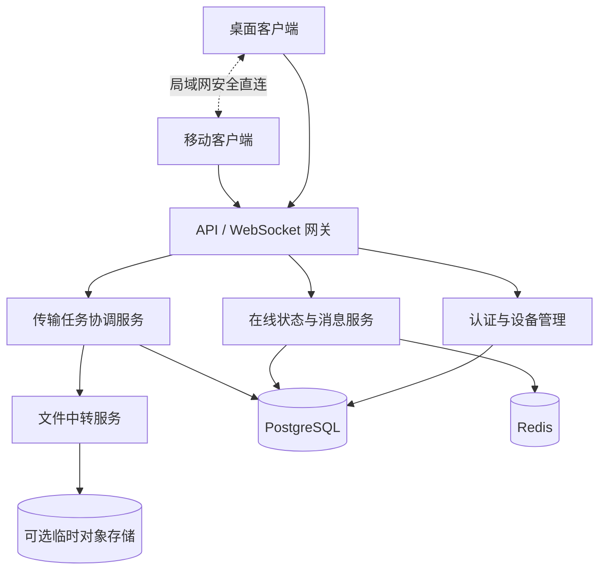

# 连信 Linkory 产品需求文档（PRD）

> **产品名称**：连信 Linkory  
> **产品定位**：跨设备即时通信与数据传输平台  
> **Slogan**：跨越距离，自由传递。  
> **文档版本**：V1.0  
> **编制日期**：2026-10-09  
> **文档状态**：需求基线稿（待评审）

## 一、产品概述

### 1.1 产品背景

用户往往同时使用 Windows、macOS、Linux、Android、iOS 等设备，跨设备传递文字、剪贴板和文件的需求频繁。现有产品各有侧重：微信提供会话交互；LocalSend 提供便捷局域网传输；ToDesk 提供设备注册和在线管理；网盘提供跨网络文件访问。连信希望整合这些产品中适合跨设备传输的体验，同时保持轻量和自建部署能力。

### 1.2 产品定位

连信 Linkory 是一款以设备为中心的轻量级跨端通信工具，融合微信式消息交互、LocalSend 式便捷文件传输和 ToDesk 式设备管理，支持自建公网中转，并逐步实现局域网直连。

**核心原则：用户只需要知道发给哪台设备，不需要知道 IP、端口、网络拓扑或中转方式。**

### 1.3 产品目标

1. 登录后自动注册当前设备并维护在线状态。
2. 在设备列表中选择目标设备，直接进入会话。
3. 支持文字、剪贴板文本及文件传输。
4. 不同网络下通过自建公网服务通信。
5. 在支持的网络条件下优先采用安全局域网直连。
6. 提供可靠的传输状态、失败处理和基础安全保障。
7. 支持个人或团队独立部署服务端。

### 1.4 目标用户

开发者、技术人员、多设备办公用户、希望自主掌控传输服务的个人用户；后续可扩展至小团队。

### 1.5 产品边界

V1.0 主要支持同一账号下设备间通信，不包含社交好友、群聊、音视频通话、远程桌面控制和云盘式长期文件管理。

## 二、用户场景

| 场景 | 用户操作 | 预期结果 |
|---|---|---|
| 电脑向手机发送文字 | 选择手机，输入文字 | 手机收到消息 |
| 手机向电脑发送剪贴板 | 复制文字，选择目标设备发送 | 电脑收到可复制内容 |
| 电脑间传输文件 | 选择设备和文件 | 接收方确认并保存 |
| 异地传输 | 两台设备位于不同网络 | 通过公网服务完成 |
| 同一局域网传输 | 选择设备发送文件 | 后续版本优先安全直连 |
| 离线消息 | 目标设备暂时离线 | 上线后同步未投递文字消息 |
| 多设备登录 | 同账号登录多个终端 | 设备列表显示各终端状态 |

## 三、信息架构与交互

### 3.1 页面结构

- **登录页**：账号注册、登录、自建服务端地址配置。
- **主界面**：设备列表、最近会话、设备在线状态。
- **设备会话页**：文字消息、剪贴板、文件发送与接收。
- **传输中心**：正在传输、已完成、失败和取消任务。
- **设备管理**：设备重命名、设备详情、移除设备。
- **设置中心**：账号、安全、保存目录、传输策略、通知设置。

### 3.2 交互原则

桌面端建议三栏布局：左侧导航、中间设备与会话列表、右侧聊天内容。移动端后续采用底部导航和独立会话页。会话对象优先为设备，而非社交联系人。

## 四、功能需求

### 4.1 账号与身份认证

| 编号 | 需求 | 优先级 |
|---|---|---|
| AUTH-001 | 用户名和密码注册 | P0 |
| AUTH-002 | 用户名和密码登录 | P0 |
| AUTH-003 | 自动保持登录状态 | P0 |
| AUTH-004 | 同账号多设备同时登录 | P0 |
| AUTH-005 | 退出登录并撤销本机会话 | P0 |
| AUTH-006 | 配置自建服务端地址 | P0 |
| AUTH-007 | 查看并撤销其他设备会话 | P1 |
| AUTH-008 | 修改密码和账号恢复 | P1 |

**规则：**每个客户端实例持有独立设备凭证；密码只存储安全哈希；登录凭证存放于操作系统安全存储；不同服务端不能直接复用身份凭证。

### 4.2 设备自动注册与管理

首次登录后创建随机设备身份及密钥，向服务端注册；后续登录验证已有凭证。凭证丢失时重新注册；设备被移除后旧凭证失效。同名设备允许存在，以唯一 ID 区分。

| 字段 | 说明 |
|---|---|
| device_id | 服务端分配的唯一设备 ID |
| device_name | 用户可编辑名称 |
| device_type | Windows、macOS、Linux、Android、iOS |
| os_version | 系统版本 |
| app_version | 客户端版本 |
| public_key | 设备认证公钥 |
| created_at | 注册时间 |
| last_seen_at | 最近在线时间 |
| status | 在线、离线、已撤销 |

不依赖 MAC 地址等硬件标识来确定设备唯一性。支持重命名、查看详情、移除和凭证吊销。

### 4.3 在线状态管理

客户端使用 WebSocket 建立长连接。建议心跳间隔 30 秒、超时判定 90 秒，断线后采用指数退避重连，最大间隔约 60 秒。状态变化后向同账号其他在线设备广播；最近在线时间由服务端维护。

移动端后台连接受到系统限制，需区分在线连接、可通知、不可达等状态，不承诺后台持续在线。

### 4.4 设备会话与文字消息

| 编号 | 需求 | 优先级 |
|---|---|---|
| MSG-001 | 发送文字和链接 | P0 |
| MSG-002 | 实时接收消息 | P0 |
| MSG-003 | 查看历史消息 | P0 |
| MSG-004 | 显示发送中、服务端已接收、目标已送达、失败 | P0 |
| MSG-005 | 离线文字消息同步 | P0 |
| MSG-006 | 消息失败重试与幂等去重 | P0 |
| MSG-007 | 一键复制消息 | P0 |
| MSG-008 | 消息搜索 | P1 |
| MSG-009 | 删除本地消息记录 | P1 |

消息采用全局唯一 ID；不能把服务端接收等同于目标设备已送达。离线文字消息默认保留 30 天，允许服务端配置。

### 4.5 剪贴板传输

V1.0 支持手动读取剪贴板文本、选择设备发送、接收后点击复制。V1.1 可扩展图片剪贴板、自动同步及循环同步抑制；V2.0 可扩展剪贴板历史。自动同步默认关闭，并遵循系统权限与敏感信息保护要求。

### 4.6 文件传输

| 编号 | 需求 | 优先级 |
|---|---|---|
| FILE-001 | 单文件发送与接收 | P0 |
| FILE-002 | 多文件批量发送 | P0 |
| FILE-003 | 接收方确认或拒绝 | P0 |
| FILE-004 | 显示进度、速度、大小和状态 | P0 |
| FILE-005 | 文件完整性校验 | P0 |
| FILE-006 | 取消与失败重试 | P0 |
| FILE-007 | 配置下载保存目录 | P0 |
| FILE-008 | 分块传输与断点续传 | P1 |
| FILE-009 | 文件夹传输 | P1 |
| FILE-010 | 拖拽文件到会话窗口 | P1 |

**业务规则：**每次传输生成独立任务 ID；接收方可接受或拒绝；文件流式处理，不整体加载到内存；接收完成前使用临时文件，完整性校验成功后再正式保存；同名文件冲突时提示重命名或覆盖；默认不自动打开可执行文件。V1.0 目标支持至少 1 GB 单文件，实际限制由部署配置决定。

### 4.7 传输链路选择

**V1.0：公网中转。**设备通过服务端协商传输任务，发送端将数据流发送到中转服务，中转服务向接收端转发。

**V1.1：局域网直连。**使用 mDNS 等发现局域网设备，完成设备身份验证后建立加密直连。优先尝试直连，失败或超时自动回退公网中转。

设置项包括：自动选择、仅局域网、仅公网中转。局域网传输同样必须验证设备身份。

### 4.8 离线策略

| 项目 | 离线文字消息 | 离线文件 |
|---|---|---|
| V1.0 | 支持 | 默认不支持 |
| 服务端处理 | 暂存并按期限清理 | 不持久保存文件内容 |
| 目标上线 | 自动同步 | 需重新发起 |
| 后续版本 | 优化同步与历史 | 可选临时缓存、过期清理 |

实时流式中转不等于永久文件存储。离线文件需要额外的存储配额、加密、生命周期与清理机制。

### 4.9 传输中心

展示正在发送、接收、完成、失败和取消的任务；提供文件名称、大小、来源、目标、速度、进度、耗时，以及取消、重试、打开文件和清理记录等操作。清理任务记录不默认删除已保存文件。

### 4.10 系统集成

桌面端支持系统托盘、开机启动、最小化到托盘、系统通知、文件拖拽和保存目录配置。移动端后续支持系统分享入口、文件选择器和通知权限管理。

## 五、技术架构

### 5.1 架构原则

采用控制平面与数据平面分离的设计：控制平面处理账号、设备、在线状态、消息和传输协商；数据平面处理文件数据流、校验和中转。V1.0 优先模块化单体后端，避免过早微服务化。

### 5.2 推荐技术栈

| 组件 | 建议 |
|---|---|
| 桌面客户端 | Tauri + Vue 3 + TypeScript |
| 原生传输模块 | Rust |
| 后端 | Go |
| API | RESTful API |
| 实时消息 | WebSocket |
| 数据库 | PostgreSQL |
| 在线状态 | Redis |
| 局域网发现 | mDNS |
| 文件校验 | SHA-256 |
| 部署 | Docker Compose |
| 移动端 | 后续评估 Flutter / Tauri Mobile |

建议抽象独立的设备身份与传输协议层，为未来跨平台客户端复用。

### 5.3 核心数据模型

| 数据表 | 作用 | 关键字段 |
|---|---|---|
| users | 用户账号 | id、username、password_hash |
| devices | 设备注册 | id、user_id、name、type、public_key |
| device_sessions | 登录会话 | id、device_id、expires_at |
| conversations | 设备会话 | id、device_a_id、device_b_id |
| messages | 消息记录 | id、conversation_id、sender_device_id、type、content |
| message_receipts | 消息回执 | message_id、device_id、status |
| transfer_tasks | 传输任务 | id、sender_device_id、receiver_device_id、size、status |
| transfer_chunks | 分块状态 | task_id、chunk_index、checksum、status |

Redis 主要维护短期在线状态；PostgreSQL 持久化设备和消息等业务数据。

### 5.4 API 草案

| 接口 | 方法 | 说明 |
|---|---|---|
| `/api/v1/auth/register` | POST | 用户注册 |
| `/api/v1/auth/login` | POST | 用户登录 |
| `/api/v1/auth/refresh` | POST | 刷新凭证 |
| `/api/v1/devices` | GET | 获取设备列表 |
| `/api/v1/devices/register` | POST | 注册设备 |
| `/api/v1/devices/{id}` | PATCH | 修改设备 |
| `/api/v1/devices/{id}` | DELETE | 移除设备 |
| `/api/v1/conversations` | GET | 获取会话列表 |
| `/api/v1/messages` | GET | 查询历史消息 |
| `/api/v1/transfers` | POST | 创建传输任务 |
| `/api/v1/transfers/{id}` | GET | 查询传输状态 |
| `/api/v1/transfers/{id}/cancel` | POST | 取消任务 |

WebSocket 事件草案：`device.online`、`device.offline`、`message.send`、`message.receive`、`message.ack`、`transfer.offer`、`transfer.accept`、`transfer.reject`、`transfer.progress`、`transfer.complete`。

协议应携带事件 ID、请求 ID、设备 ID、时间戳、协议版本，并具备鉴权、权限校验和幂等处理。

## 六、状态机与异常处理

### 6.1 设备状态

- `ONLINE`：有效连接存在。
- `OFFLINE`：当前无有效连接。
- `RECONNECTING`：客户端正在重连（本地状态）。
- `REVOKED`：设备凭证已撤销。

### 6.2 文件任务状态

`CREATED → WAITING_ACCEPT → ACCEPTED → TRANSFERRING → VERIFYING → COMPLETED`

异常终态包括 `REJECTED`、`CANCELLED`、`FAILED`、`EXPIRED`。所有状态变更由服务端校验。

### 6.3 异常场景

| 场景 | 处理要求 |
|---|---|
| 服务端不可达 | 提示连接失败并自动重试 |
| 登录凭证过期 | 尝试刷新，失败后重新登录 |
| 设备突然离线 | 更新在线状态并保留必要任务记录 |
| 接收方拒绝 | 终止任务并通知发送方 |
| 传输中断 | 失败提示或进入可恢复状态 |
| 文件校验失败 | 不保存为正式文件，提示重试 |
| 磁盘空间不足 | 中止写入并提示 |
| 文件无读取权限 | 提示重新选择 |
| 多设备同名 | 展示设备类型等辅助信息 |
| 局域网直连失败 | 自动尝试公网中转 |
| 服务端存储不足 | 拒绝需缓存的任务并返回错误 |
| 设备被撤销 | 终止其认证会话和未授权传输 |

## 七、安全与隐私

1. **账号安全**：使用 Argon2id 等安全密码哈希算法，支持登录限流、Token 轮换与撤销。
2. **设备安全**：每台设备使用独立密钥；移除设备后旧凭证失效。
3. **链路安全**：HTTPS、WSS、TLS；局域网直连也必须验证设备身份。
4. **访问控制**：账号和设备权限隔离，所有 API 与实时事件校验访问权限。
5. **数据保留**：消息、任务和可选临时文件的保留期限可配置。
6. **日志隐私**：不在普通日志中记录密码、Token、敏感剪贴板或文件内容。
7. **端到端加密**：预留设计，未实现前仅声明链路加密，不宣称服务端无法读取内容。

## 八、非功能性需求

以下为建议验收目标，需在明确测试环境后验证。

| 指标 | 建议目标 |
|---|---|
| 消息时效 | 正常网络下 P95 投递延迟 < 1 秒 |
| 状态同步 | 设备状态变化通常 5 秒内广播 |
| 文件大小 | 至少支持 1 GB 单文件 |
| 连接恢复 | 网络恢复后自动重连 |
| 传输可靠性 | 校验、失败提示、重试机制 |
| 资源占用 | 控制常驻 CPU 与内存占用 |
| 自建部署 | Docker Compose 单机部署 |
| 可观测性 | 日志、健康检查、基础指标 |

## 九、版本规划

### V1.0：跨公网通信闭环

账号注册登录、自动设备注册、在线状态、设备会话、文字消息、手动剪贴板传输、文件公网流式中转、传输中心、自建部署。

**验收目标：**两台位于不同网络的桌面设备登录同一账号后，能够稳定互发消息和文件。

### V1.1：传输体验增强

局域网发现、安全直连、自动回退、断点续传、文件夹传输、自动剪贴板同步、拖拽与桌面快捷操作。

**验收目标：**同局域网设备在满足条件时无需经过公网中转即可传输文件。

### V2.0：多端生态扩展

Android、iOS 客户端、系统分享入口、跨账号设备授权、可选离线文件缓存、端到端加密、消息搜索。

**验收目标：**桌面和移动设备可通过统一账号体系完成日常数据传输。

## 十、V1.0 验收用例

| 编号 | 场景 | 通过条件 |
|---|---|---|
| AT-01 | 首次登录 | 自动注册设备并进入主界面 |
| AT-02 | 多设备登录 | 列表显示所有已注册设备 |
| AT-03 | 在线变化 | 断开与恢复后状态正确更新 |
| AT-04 | 跨公网文字 | 不同网络设备正常收发 |
| AT-05 | 离线消息 | 设备上线后同步未投递消息 |
| AT-06 | 剪贴板文本 | 正确发送、接收和复制 |
| AT-07 | 文件传输 | 接收方确认后完成传输 |
| AT-08 | 完整性 | 收发文件校验值一致 |
| AT-09 | 网络异常 | 不无限等待，能够提示或重试 |
| AT-10 | 权限隔离 | 其他账号不能访问本账号设备及消息 |
| AT-11 | 设备移除 | 被移除设备不能使用旧凭证 |
| AT-12 | 自建部署 | 按文档独立安装并运行 |

## 十一、待确认的产品决策

| 决策 | 当前建议 |
|---|---|
| 首批平台 | Windows + macOS |
| 账号体系 | 用户名密码登录 |
| 设备关系 | 同账号设备互传 |
| V1.0 传输方式 | 公网流式中转 |
| V1.1 传输方式 | 局域网直连 + 自动回退 |
| 离线文字 | 支持，默认保留 30 天 |
| 离线文件 | V1.0 暂不支持 |
| 部署模式 | 个人自建，Docker Compose |
| 后端架构 | 模块化单体 + 独立传输模块 |
| 优先级原则 | 稳定可靠优先于功能数量 |

上述内容属于产品规划假设，正式开发前需经需求评审确认。

## 十二、产品总结

连信 Linkory 的差异化不在于单独具备聊天、文件传输或设备管理功能，而在于将三者整合为统一的设备通信体验。

**核心用户路径：登录连信 → 选择设备 → 发送内容 → 对方接收。**

正式开发前，优先冻结设备身份模型、消息投递语义、文件任务状态机与服务端存储策略，确保客户端和服务端协议一致。
