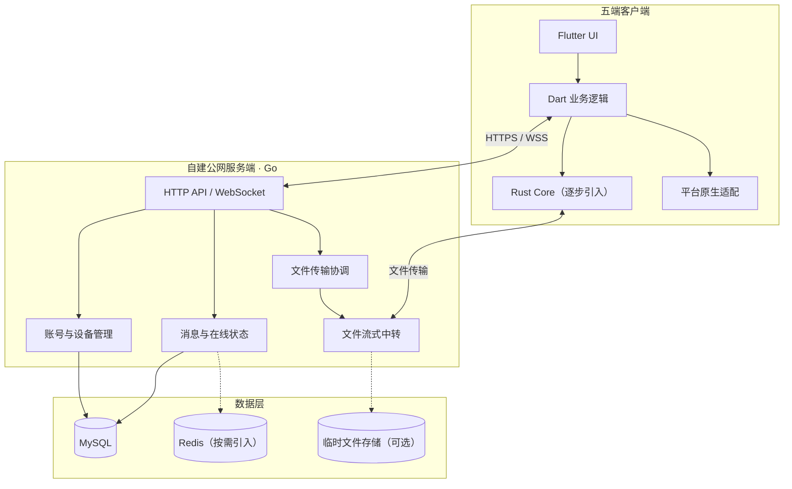

# 连信 Linkory：最终技术选型与开发实施方案

> 版本：V1.0  
> 技术变更：将 PostgreSQL 替换为 **MySQL**，其他技术选型与开发计划保持不变。

结合主要依赖 AI 辅助编程、没有固定技术栈、希望最终覆盖 Windows / macOS / Linux / Android / iOS 五个平台的实际情况，推荐 **Flutter + Rust Core + Go Server**，采用渐进式架构：先用 Flutter + Go 完成可运行 MVP，再逐步引入 Rust Core。

## 一、框架选型

| 比较维度 | Flutter | Tauri 2 |
|---|---|---|
| Windows / macOS / Linux | 官方支持 | 支持 |
| Android / iOS | 成熟的跨平台开发路径 | 支持，但插件适配需重点验证 |
| 微信式聊天界面 | 适合 | 适合 |
| 系统托盘 | 需要插件或原生实现 | 需要插件或原生实现 |
| 文件系统访问 | 插件与原生接口 | Rust 与插件 |
| 与 Rust 核心集成 | 通过 FFI / Bridge | Rust 集成更直接 |
| AI 生成 UI 的便利性 | 较好 | 较好 |
| 单套 UI 覆盖五端 | 更符合目标 | 可行，但移动端风险相对更高 |

选择 Flutter 的核心原因是五端一致性，而不是单纯的性能。Tauri 2 对桌面优先、熟悉 Web 前端的团队有吸引力；本项目没有既有技术栈负担，可以直接围绕五端目标选型。不建议以 Electron 为主框架，因为仍需另行解决 Android 和 iOS 客户端。

## 二、整体技术架构



### 模块职责

| 模块 | 技术 | 负责什么 |
|---|---|---|
| 界面层 | Flutter | 登录、设备列表、聊天、文件进度 |
| 应用逻辑 | Dart | 页面状态、API 调用、消息展示 |
| 本地数据 | SQLite | 消息缓存、设备缓存、传输记录 |
| 核心通信 | Rust（后期） | 文件流、局域网发现、传输调度 |
| 服务端 | Go | 用户、设备、消息、传输协商 |
| 持久化 | **MySQL** | 账号、设备、消息、任务 |
| 在线状态 | 初期 Go 内存，后期 Redis | 心跳、连接索引、状态广播 |
| 部署 | Docker Compose | 自建服务部署 |

Rust Core 不应在第一阶段承担所有业务。Flutter 的 Dart 本身支持 WebSocket、HTTP 和文件操作，最初的文字消息、设备管理和简单文件传输可以先用 Dart 实现。待协议稳定，再把分块调度、断点续传、局域网发现等功能迁入 Rust；可通过 `flutter_rust_bridge` 集成。

## 三、重要架构决策

### 3.1 V1.0 不使用微服务

一个 Go 后端程序即可承载账号、设备、消息与文件传输管理。

```text
linkory-server
├── Go API + WebSocket
├── MySQL
└── 文件中转模块
```

需要多实例部署时再引入 Redis，协调在线状态和跨实例消息路由。

### 3.2 WebSocket 管控制，文件走独立通道

- **WebSocket**：在线状态、文字消息、传输邀请、进度通知。
- **HTTPS 流式上传/下载**：V1.0 公网文件传输。
- **局域网安全直连**：V1.1 实现。
- **分块与断点续传**：协议预留，后续完善。

不要把大文件 Base64 编码后塞入聊天 WebSocket 消息，这会增加体积和内存压力。

### 3.3 共享协议，而不是共享全部系统代码

Windows、macOS、Linux 共享大部分 Flutter UI 和业务逻辑；Android、iOS 还需要分别适配后台生命周期、系统分享、通知与文件权限。跨平台框架并不能绕过移动操作系统的后台限制。

### 3.4 第一版建立设备身份安全

每台设备具有独立设备 ID 和密钥。登录成功后完成设备注册或重新认证。服务端不得仅凭客户端提供的 `device_id` 信任设备，消息访问与文件下载都必须校验账号、设备和任务权限。

## 四、七阶段开发计划

### 阶段 01：工程初始化与 UI 骨架（3–5 天）

创建 Flutter 客户端、Go 服务端、**MySQL**、Docker Compose。完成登录页、主界面、设备列表、会话页的静态布局。

**验收：** 客户端可以启动，服务端健康检查正常。

### 阶段 02：账号与设备注册（5–7 天）

完成注册、登录、Token、设备身份、自动注册、设备列表、设备重命名与移除。

**验收：** 两个客户端登录同一账号后，能看到彼此的设备。

### 阶段 03：设备在线状态与文字消息（7–10 天）

实现 WebSocket、心跳、重连、设备状态广播、消息收发、历史记录、离线消息。

**验收：** 两台不同网络的电脑能够实时互发消息，断线重连后消息不重复。

### 阶段 04：剪贴板与公网文件传输（10–14 天）

实现手动剪贴板发送、文件选择、传输邀请、流式中转、进度、校验、取消和失败处理。

**验收：** 跨公网发送 1 GB 文件，接收结果与原文件一致。

### 阶段 05：桌面端体验完善（5–7 天）

增加系统托盘、通知、窗口管理、下载目录、错误提示、日志、安装包和基础自动化测试。

**验收：** 应用最小化后仍可接收消息，重启后恢复登录。

### 阶段 06：Rust Core 与局域网直连（10–15 天）

抽象传输接口，引入 Rust Core，开发局域网发现、安全直连、分块调度和断点续传。

**验收：** 局域网直连可用，失败后能够回退公网中转。

### 阶段 07：Android / iOS 与 Linux 适配（15–25 天）

完善移动端布局、通知、系统分享、文件访问和后台限制处理；完成 Linux 打包及五端兼容测试。

**验收：** 五端能够完成约定的前台消息和文件传输场景。

> 预计：桌面端 MVP（阶段 1–5）约 **6–10 周**；五端初步可用（阶段 1–7）约 **11–18 周**。这些是单人 AI 辅助开发的粗略估计，不包含正式商店审核、生产安全审计或不可预期的原生兼容问题。

## 五、五端开发顺序

| 顺序 | 平台 | 原因 |
|---|---|---|
| 1 | macOS | 适合作为主要开发和调试平台 |
| 2 | Windows | 重要桌面用户群，尽早验证跨系统通信 |
| 3 | Android | 验证移动端 UI、文件权限、通知与后台行为 |
| 4 | iOS | 处理更严格的后台限制和系统集成 |
| 5 | Linux | 复用桌面 UI，集中完成依赖和发行包适配 |

如果主要使用 Windows 开发，可以将 Windows 放在第一位。iOS 构建需要 macOS，Windows 桌面构建通常需要 Windows 环境，建议使用对应平台的 CI 构建机。

## 六、推荐项目目录

```text
linkory/
├── apps/
│   └── linkory_client/          # Flutter 五端客户端
│       ├── lib/
│       │   ├── app/             # 应用启动与路由
│       │   ├── core/            # 配置、网络、存储
│       │   ├── features/
│       │   │   ├── auth/
│       │   │   ├── devices/
│       │   │   ├── messages/
│       │   │   ├── clipboard/
│       │   │   ├── transfers/
│       │   │   └── settings/
│       │   └── shared/          # 通用 UI 组件
│       └── test/
│
├── crates/
│   └── linkory_core/            # Rust 核心（后期引入）
│       └── src/
│           ├── transport/
│           ├── discovery/
│           ├── crypto/
│           └── protocol/
│
├── server/
│   ├── cmd/
│   ├── internal/
│   │   ├── auth/
│   │   ├── devices/
│   │   ├── presence/
│   │   ├── messages/
│   │   └── transfers/
│   └── migrations/             # MySQL 数据库迁移
│
├── packages/
│   └── protocol/                # 协议定义与 Schema
│
├── deploy/
│   └── docker-compose.yml      # Go + MySQL
│
├── docs/
│   ├── PRD.md
│   ├── architecture.md
│   ├── api.md
│   └── development-plan.md
│
└── README.md
```

`packages/protocol` 建议维护 OpenAPI、JSON Schema 等语言无关的协议定义，避免在 Dart、Go、Rust 中各自手写不一致的数据结构。

## 七、AI 辅助开发工程规范

1. **按模块交付**：每次完成一个清晰的任务，不要一次生成整个系统。
2. **先协议后 UI**：消息类型、状态码、设备身份规则写入统一协议文档。
3. **自动化测试**：Go 执行单元及集成测试，Flutter 执行 `flutter analyze` 和 `flutter test`，Rust 后续执行 `cargo test`。
4. **保留可运行基线**：每个阶段通过测试后再合并，便于回退。
5. **重视端到端测试**：验证两个真实客户端经过服务端完成登录、设备发现、消息收发和文件传输。

## 八、最终技术决策

| 决策项 | 最终建议 |
|---|---|
| 客户端框架 | **Flutter** |
| 服务端语言 | **Go** |
| 核心传输引擎 | **Rust，按需逐步引入** |
| 客户端状态管理 | Riverpod |
| 本地数据库 | SQLite / Drift |
| 服务端数据库 | **MySQL** |
| 在线通信 | WebSocket |
| 文件传输 | HTTPS 流式传输 |
| 局域网发现 | mDNS |
| 服务端部署 | Docker Compose |
| 开发模式 | AI 辅助 + 小步迭代 + 自动化测试 |

**最重要的建议：第一阶段不要开发 Rust，也不要同时开发五端。** 先完成 Flutter 桌面客户端和 Go 服务端，让两台真实设备通过公网互发文字、剪贴板和文件；再引入 Rust 和移动端，降低项目复杂度与返工风险。

下一步可基于本方案编写可直接交给 AI 编程工具执行的技术开发任务书，进一步明确 MySQL 表结构、接口契约、测试用例和阶段验收标准。
